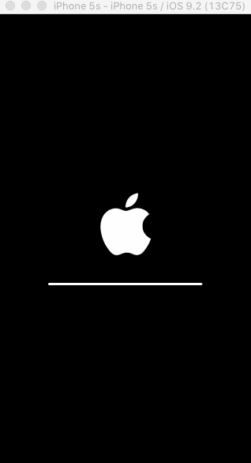
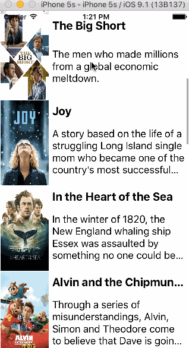

# Project 1 - *Flick Finder*

**Flick Finder** is a movies app using the [The Movie Database API](http://docs.themoviedb.apiary.io/#).

Time spent: **5** hours spent in total

## User Stories

The following **required** functionality is complete:

- [x] User can view a list of movies currently playing in theaters from The Movie Database.
- [x] Poster images are loaded using the UIImageView category in the AFNetworking library.
- [x] User sees a loading state while waiting for the movies API.
- [x] User can pull to refresh the movie list.

The following **optional** features are implemented:

- [x] All images fade in as they are loading.
- [x] User can search for a movie.
- [ ] Movies are displayed using a CollectionView instead of a TableView.
- [ ] User can select from a tab bar for either "Now Playing" or "Top Rated" movies.
- [ ] User sees an error message when there's a networking error.  
- [ ] Customize the UI.

The following **additional** features are implemented:

- [x] Error image loads if poster image fails
- [x] Images resize to fit imageView if larger

## Video Walkthrough

Here's a walkthrough of implemented user stories (captured for week1):

GIF created with [LiceCap](http://www.cockos.com/licecap/). See below for a current walkthrough.

## Notes

The EZLoading pod seems to be unreliable, particularly with it's delay settings not 
respecting the "seconds" definition.

So far, unable to create a collection view that works (working in another project), 
get the broken outlet error, without any outlets broken (and starting from scratch 
multiple times).

# Project 2 - *Flick Finder (continued)*

**Flick Finder** is a movies app displaying box office and top rental DVDs using [The Movie Database API](http://docs.themoviedb.apiary.io/#).

Time spent: **0** hours spent in total

## User Stories

The following **required** functionality is completed:

- [x] User can view movie details by tapping on a cell.
- [x] User can select from a tab bar for either **Now Playing** or **Top Rated** movies.
- [x] Customize the selection effect of the cell.

The following **optional** features are implemented:

- [ ] For the large poster, load the low resolution image first and then switch to the high resolution image when complete.
- [ ] Customize the navigation bar.

The following **additional** features are implemented:

- [ ] List anything else that you can get done to improve the app functionality!

Please list two areas of the assignment you'd like to **discuss further with your peers** during the next class (examples include better ways to implement something, how to extend your app in certain ways, etc):

1. 
2. 

## Video Walkthrough 

Here's a walkthrough of implemented user stories:

GIF created with [LiceCap](http://www.cockos.com/licecap/).

## Notes

The asset manager didn't seem to obey the human interface guidelines from apple. 76x76 icons (iPad1&2) were too large until they were moved into the x3 slot (which is supposed to be for iPhone6 & 180x180)

## License

    Copyright [2016] [Eric Zimmerman]

    Licensed under the Apache License, Version 2.0 (the "License");
    you may not use this file except in compliance with the License.
    You may obtain a copy of the License at

        http://www.apache.org/licenses/LICENSE-2.0

    Unless required by applicable law or agreed to in writing, software
    distributed under the License is distributed on an "AS IS" BASIS,
    WITHOUT WARRANTIES OR CONDITIONS OF ANY KIND, either express or implied.
    See the License for the specific language governing permissions and
    limitations under the License.
